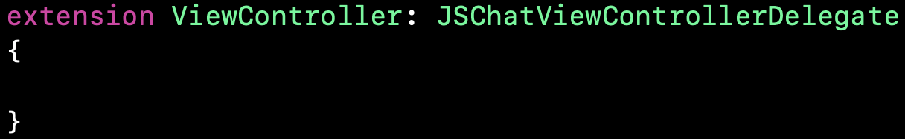

# JSMessageKit-Swift
JSMessageKit is open chatting ui library. This library is made for Swift(iOS).

JSMessageKit-Swift Features :

  * Open Source for free
  * Simple to use
  * Quickly apply chatting UI
  
JSMessageKit Versions
-----------------------  

|Version|Date|Link|
| ----|----|----|
|Prototype v.0.1.0|2020.04.16|https://github.com/billnjoyce/JSMessageKit-Swift/releases/tag/Prototype-v.0.1.0|

JSMessageKit Architecture
-----------------------  

### Requirements

For development, the following minimum development requirements must be observed.

> - **Xcode 11.0 or higher.**
> - **Swift 5.0 or higher.**

## Usages 

1. Make a swift project what you want. 

2. Import all sources and files under 'JSMessageKit-Swift/src/JSMessageKit' into the project.

3. Inherit the JSChatViewController class to the viewcontroller that will display the chat screen as shown below.

4. Set the message sender as shown below.

5. Set the sender representing yourself among the set senders.

6. Enter the desired message as shown below.

7. You can receive the event by setting the relevant event delegate for the chat screen to be provided in the future as follows (current prototype does not have an event delegate function).

## Sample app screen

Next to do
----------
* Add an image message
* Add a video message(Releasing for alpha version)
* Add an emoticon message
* Add a message action(Releasing for beta version) 
* And more...

License
----------

JSMessageKit is licensed under the [MIT License](https://opensource.org/licenses/MIT). 
Just free for use.

Contact us
----------

E-Mail : ibillkim@gmail.com
